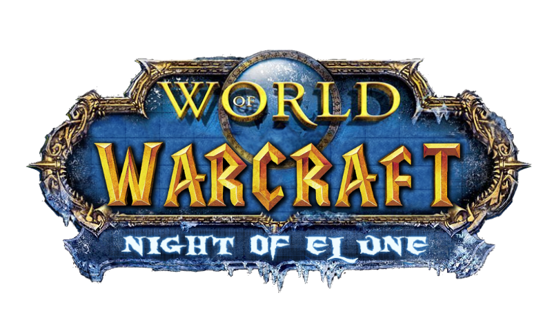

# 🎮 WoW Private Server - Web Management System

<div align="center">
  
  
  **Полнофункциональная веб-система для управления приватным сервером World of Warcraft**
  
  [](https://laravel.com)
  [](https://www.azerothcore.org)
  [](https://php.net)
  [](https://mysql.com)
</div>

---

## 🌟 **Основные возможности**

### 👥 **Пользовательская система**
- ✅ **Регистрация и авторизация** с активацией аккаунтов
- ✅ **Личный кабинет** с управлением профилем
- ✅ **Безопасность** - SRP6 аутентификация, смена паролей
- ✅ **Персонализация** - аватары персонажей

### 🎮 **Игровые функции**
- ✅ **Армори** - детальная информация о персонажах
- ✅ **Онлайн игроки** - список активных игроков в реальном времени
- ✅ **Статус сервера** - мониторинг состояния сервера
- ✅ **Телепортация** - GM команды для игроков

### 🛡️ **Административная панель**
- ✅ **Управление банами** - аккаунты, персонажи, IP адреса
- ✅ **Модерация новостей** - создание и редактирование с CKEditor
- ✅ **Модерация комментариев** - одобрение/отклонение
- ✅ **SOAP интеграция** - выполнение GM команд через веб-интерфейс
- ✅ **Статистика сервера** - детальная аналитика

### 🛒 **Игровой магазин**
- ✅ **Магазин предметов** - покупка игровых предметов
- ✅ **Система валют** - игровые деньги и донат валюта
- ✅ **Платежные системы** - интеграция с различными провайдерами

### 🌐 **Социальные функции**
- ✅ **Система новостей** - с богатым текстовым редактором
- ✅ **Комментарии** - с системой модерации
- ✅ **Голосование** - интеграция с MMOTOP
- ✅ **Многоязычность** - русский и английский языки

---

## 🏗️ **Техническая архитектура**

### **Backend**
- **Laravel 10.x** - современный PHP фреймворк
- **AzerothCore** - серверная часть World of Warcraft
- **MySQL 8.0+** - база данных (auth, characters, world)
- **SOAP API** - интеграция с игровым сервером

### **Frontend**
- **Bootstrap 5** - адаптивный дизайн
- **CKEditor 5** - богатый текстовый редактор
- **Font Awesome** - иконки
- **Custom CSS** - уникальный дизайн в стиле WoW

### **Интеграции**
- **MMOTOP** - система голосования
- **SOAP** - выполнение GM команд
- **Email** - уведомления и активация
- **Redis** - кэширование (опционально)

---

## 🚀 **Быстрый старт**

### **Требования**
- PHP 8.1+
- MySQL 8.0+
- Composer
- Node.js & NPM

### **Установка**
```bash
# Клонирование репозитория
git clone <repository-url>
cd wow-private-server

# Установка зависимостей
composer install
npm install

# Настройка окружения
cp .env.example .env
php artisan key:generate

# Настройка базы данных
php artisan migrate
php artisan db:seed

# Сборка фронтенда
npm run build
```

### **Конфигурация**
```env
# База данных
DB_CONNECTION=mysql
DB_HOST=127.0.0.1
DB_PORT=3306
DB_DATABASE=wow_auth
DB_USERNAME=root
DB_PASSWORD=

# WoW Server
WOW_SOAP_URL=http://localhost:7878
WOW_SOAP_USERNAME=admin
WOW_SOAP_PASSWORD=admin
WOW_SERVER_NAME=AzerothCore
```

---

## 📋 **Доступные GM команды**

### **Управление игроками**
- `.kick {player} {reason}` - кик игрока
- `.ban account {account} {duration} {reason}` - бан аккаунта
- `.ban character {character} {duration} {reason}` - бан персонажа
- `.ban ip {ip} {duration} {reason}` - бан IP адреса

### **Телепортация**
- `.teleport {player} {x} {y} {z} {map}` - телепорт к координатам
- `.appear {player}` - телепорт к игроку
- `.summon {player}` - призыв игрока
- `.unstuck {player}` - разблокировка персонажа

### **Управление персонажами**
- `.revive {player}` - воскрешение
- `.heal {player}` - лечение
- `.morph {player} {displayid}` - изменение внешности
- `.freeze {player}` - заморозка
- `.mute {player} {duration} {reason}` - мут

### **Предметы и валюта**
- `.additem {player} {itemid} {count}` - добавление предметов
- `.addmoney {player} {amount}` - добавление денег
- `.removemoney {player} {amount}` - удаление денег

---

## 🔧 **API Endpoints**

### **Пользователи**
- `GET /account` - личный кабинет
- `POST /account/email` - смена email
- `POST /account/password` - смена пароля
- `POST /account/teleport` - телепортация персонажа

### **Администрация**
- `GET /admin/dashboard` - панель администратора
- `GET /admin/bans` - управление банами
- `POST /admin/bans` - создание бана
- `DELETE /admin/bans/{id}` - удаление бана

### **Игровые данные**
- `GET /armory/{character}` - информация о персонаже
- `GET /online-players` - список онлайн игроков
- `GET /server-status` - статус сервера

---

## 🌍 **Многоязычность**

Система поддерживает два языка:
- 🇷🇺 **Русский** - основной язык
- 🇺🇸 **Английский** - международный язык

Все тексты локализованы и автоматически определяются по настройкам браузера.

---

## 🛡️ **Безопасность**

- **SRP6 аутентификация** - безопасная авторизация
- **CSRF защита** - защита от межсайтовых атак
- **Валидация данных** - проверка всех входящих данных
- **Логирование** - отслеживание всех действий
- **Роли и права** - разграничение доступа

---

## 📊 **Мониторинг**

- **Статус сервера** - онлайн/оффлайн состояние
- **Количество игроков** - в реальном времени
- **Время работы** - uptime сервера
- **Статистика банов** - активные/истекшие баны
- **Логи действий** - детальная история

---

## 🤝 **Поддержка**

Для получения поддержки:
- 📧 **Email**: support@wowserver.com
- 💬 **Discord**: [Ссылка на сервер]
- 📖 **Документация**: [Ссылка на документацию]

---

## 📄 **Лицензия**

Этот проект распространяется под лицензией MIT. См. файл [LICENSE](LICENSE) для подробностей.

---

<div align="center">
  <p>Создано с ❤️ для сообщества World of Warcraft</p>
  <p>Powered by Laravel & AzerothCore</p>
</div>

---

# 🎮 WoW Private Server - Web Management System

<div align="center">
  
  
  **Full-featured web management system for World of Warcraft private server**
  
  [](https://laravel.com)
  [](https://www.azerothcore.org)
  [](https://php.net)
  [](https://mysql.com)
</div>

---

## 🌟 **Key Features**

### 👥 **User System**
- ✅ **Registration & Authentication** with account activation
- ✅ **Personal Dashboard** with profile management
- ✅ **Security** - SRP6 authentication, password changes
- ✅ **Personalization** - character avatars

### 🎮 **Game Features**
- ✅ **Armory** - detailed character information
- ✅ **Online Players** - real-time active players list
- ✅ **Server Status** - server state monitoring
- ✅ **Teleportation** - GM commands for players

### 🛡️ **Administrative Panel**
- ✅ **Ban Management** - accounts, characters, IP addresses
- ✅ **News Moderation** - creation and editing with CKEditor
- ✅ **Comment Moderation** - approval/rejection system
- ✅ **SOAP Integration** - GM command execution via web interface
- ✅ **Server Statistics** - detailed analytics

### 🛒 **Game Shop**
- ✅ **Item Shop** - purchase game items
- ✅ **Currency System** - game money and donation currency
- ✅ **Payment Systems** - integration with various providers

### 🌐 **Social Features**
- ✅ **News System** - with rich text editor
- ✅ **Comments** - with moderation system
- ✅ **Voting** - MMOTOP integration
- ✅ **Multilingual** - Russian and English languages

---

## 🏗️ **Technical Architecture**

### **Backend**
- **Laravel 10.x** - modern PHP framework
- **AzerothCore** - World of Warcraft server core
- **MySQL 8.0+** - database (auth, characters, world)
- **SOAP API** - game server integration

### **Frontend**
- **Bootstrap 5** - responsive design
- **CKEditor 5** - rich text editor
- **Font Awesome** - icons
- **Custom CSS** - unique WoW-style design

### **Integrations**
- **MMOTOP** - voting system
- **SOAP** - GM command execution
- **Email** - notifications and activation
- **Redis** - caching (optional)

---

## 🚀 **Quick Start**

### **Requirements**
- PHP 8.1+
- MySQL 8.0+
- Composer
- Node.js & NPM

### **Installation**
```bash
# Clone repository
git clone <repository-url>
cd wow-private-server

# Install dependencies
composer install
npm install

# Setup environment
cp .env.example .env
php artisan key:generate

# Setup database
php artisan migrate
php artisan db:seed

# Build frontend
npm run build
```

### **Configuration**
```env
# Database
DB_CONNECTION=mysql
DB_HOST=127.0.0.1
DB_PORT=3306
DB_DATABASE=wow_auth
DB_USERNAME=root
DB_PASSWORD=

# WoW Server
WOW_SOAP_URL=http://localhost:7878
WOW_SOAP_USERNAME=admin
WOW_SOAP_PASSWORD=admin
WOW_SERVER_NAME=AzerothCore
```

---

## 📋 **Available GM Commands**

### **Player Management**
- `.kick {player} {reason}` - kick player
- `.ban account {account} {duration} {reason}` - ban account
- `.ban character {character} {duration} {reason}` - ban character
- `.ban ip {ip} {duration} {reason}` - ban IP address

### **Teleportation**
- `.teleport {player} {x} {y} {z} {map}` - teleport to coordinates
- `.appear {player}` - teleport to player
- `.summon {player}` - summon player
- `.unstuck {player}` - unstuck character

### **Character Management**
- `.revive {player}` - revive player
- `.heal {player}` - heal player
- `.morph {player} {displayid}` - change appearance
- `.freeze {player}` - freeze player
- `.mute {player} {duration} {reason}` - mute player

### **Items and Currency**
- `.additem {player} {itemid} {count}` - add items
- `.addmoney {player} {amount}` - add money
- `.removemoney {player} {amount}` - remove money

---

## 🔧 **API Endpoints**

### **Users**
- `GET /account` - personal dashboard
- `POST /account/email` - change email
- `POST /account/password` - change password
- `POST /account/teleport` - teleport character

### **Administration**
- `GET /admin/dashboard` - admin panel
- `GET /admin/bans` - ban management
- `POST /admin/bans` - create ban
- `DELETE /admin/bans/{id}` - delete ban

### **Game Data**
- `GET /armory/{character}` - character information
- `GET /online-players` - online players list
- `GET /server-status` - server status

---

## 🌍 **Multilingual Support**

The system supports two languages:
- 🇷🇺 **Russian** - primary language
- 🇺🇸 **English** - international language

All texts are localized and automatically detected based on browser settings.

---

## 🛡️ **Security**

- **SRP6 Authentication** - secure authorization
- **CSRF Protection** - cross-site request forgery protection
- **Data Validation** - validation of all incoming data
- **Logging** - tracking of all actions
- **Roles & Permissions** - access control

---

## 📊 **Monitoring**

- **Server Status** - online/offline state
- **Player Count** - real-time player count
- **Uptime** - server uptime
- **Ban Statistics** - active/expired bans
- **Action Logs** - detailed history

---

## 🤝 **Support**

For support:
- 📧 **Email**: support@wowserver.com
- 💬 **Discord**: [Server Link]
- 📖 **Documentation**: [Documentation Link]

---

## 📄 **License**

This project is licensed under the MIT License. See the [LICENSE](LICENSE) file for details.

---

<div align="center">
  <p>Created with ❤️ for the World of Warcraft community</p>
  <p>Powered by Laravel & AzerothCore</p>
</div>